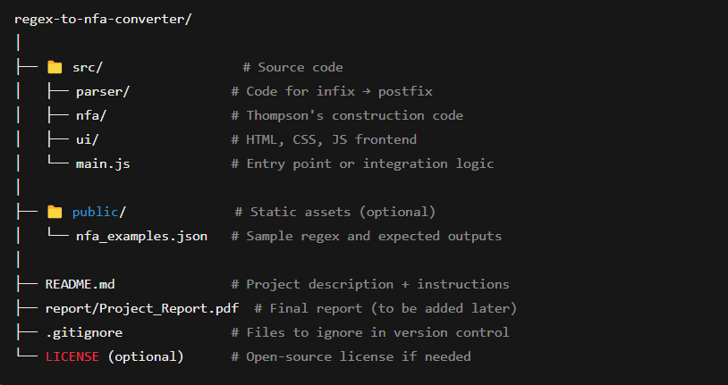

# 🎯 RegEx-to-NFA-Converter (Python Version)

A simple, educational tool that **parses regular expressions (regex)** and visualizes their equivalent **Non-deterministic Finite Automata (NFA)** using **Thompson’s Construction** — now entirely in **Python**.

---

## 📁 Project Directory Structure



### Project Layout (Python Version):
```
regex_to_nfa_project/
├── parser/             ← infix ➤ postfix conversion
│   └── infix_to_postfix.py
│
├── nfa/                ← Thompson's construction
│   └── thompson.py
│
├── visualizer/         ← (Optional) graph drawing with networkx/matplotlib
│   └── draw_nfa.py
│
├── main.py             ← user input, conversion pipeline
```

---

## 🧠 Regex Parser (Python)

We implemented the **infix ➤ postfix** conversion using the **Shunting Yard Algorithm**, with automatic insertion of explicit concatenation (`.`) operators.

📄 **Code Location**:  
`parser/infix_to_postfix.py`

### ✅ Features:
- Supports grouping, union (`|` or `+`), Kleene star (`*`), one-or-more (`+`), and optional (`?`)
- Automatically adds `.` between implicitly concatenated tokens
- Converts `+` to `|` for union (internally normalized)
- Clean postfix output ready for NFA generation

---

## 🔧 NFA Generator (Thompson’s Construction)

We use **Thompson’s Construction** to build an NFA from the postfix expression.

📄 **Code Location**:  
`nfa/thompson.py`

### ✅ Supports:
- Basic characters (a–z, A–Z, 0–9)
- Kleene Star (`*`)
- Union (`|`)
- Concatenation (`.`)
- One or more (`+`)
- Optional (`?`)

> The output is a linked structure of `state()` objects representing transitions with or without ε.

---

## 🔁 Integration

In `main.py`, we connect everything:

1. ✅ Get user input
2. ✅ Insert explicit concatenation
3. ✅ Convert to postfix
4. ✅ Build NFA using Thompson’s Construction
5. ✅ (Optional) Visualize using `networkx` (planned)

---

## 🧪 Example:

```text
Input:     a + (b * c - (d / e ^ f) * g) * h
Parsed:    a + (b * c . - (d / e ^ f) * g) * h
Postfix:   a b c * . d e / f ^ . g * - . h * . |
```

✅ NFA built successfully.

---

## 💡 Next Steps

- [ ] Add NFA visualization using `networkx` or `graphviz`
- [ ] Support character ranges like `[0-9]`
- [ ] Add frontend to accept input and render visual graph (1-page interface)

---

## 💻 Tech Stack (Python-Based)

| Purpose           | Tool/Library              |
|------------------|---------------------------|
| Regex Parsing     | Python + custom logic     |
| NFA Construction  | Python (OOP with states)  |
| Visualization     | `networkx`, `matplotlib` *(planned)* |
| Web frontend      | HTML/CSS/JS *(planned)*   |

---

## 👥 Team

> Add your names & IDs here

---

## 📜 License

MIT License (or any license of your choice)

---
